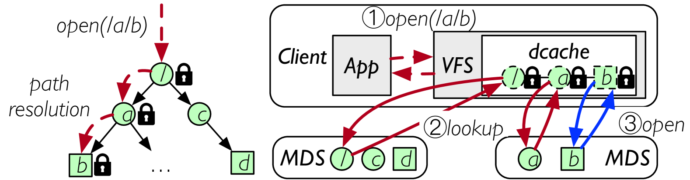
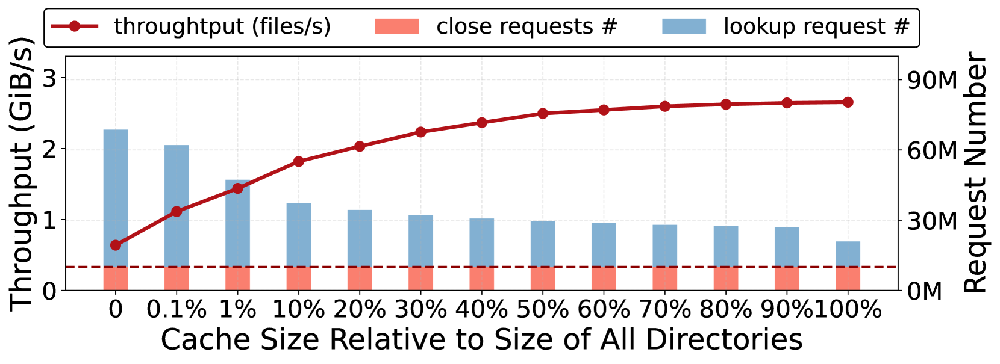
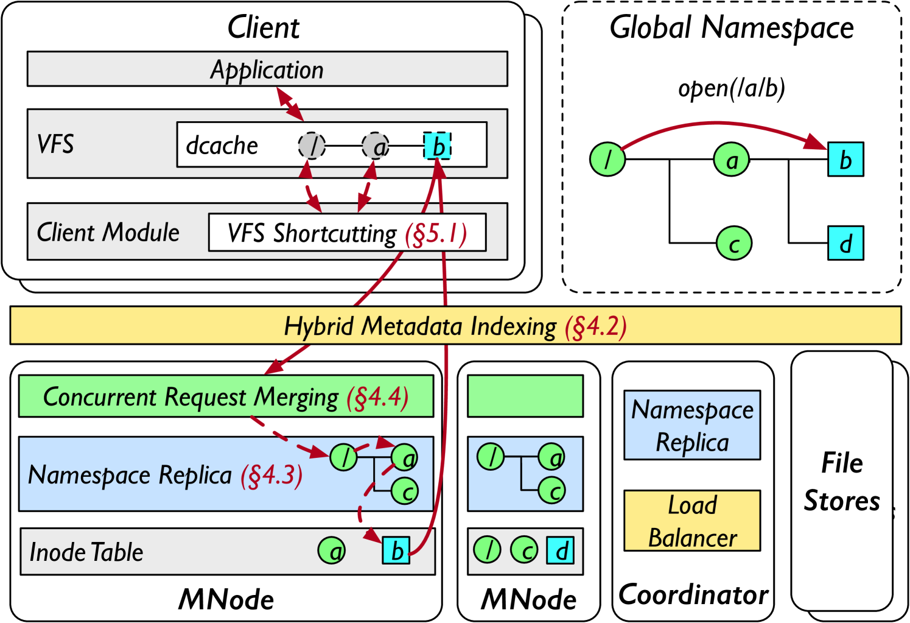
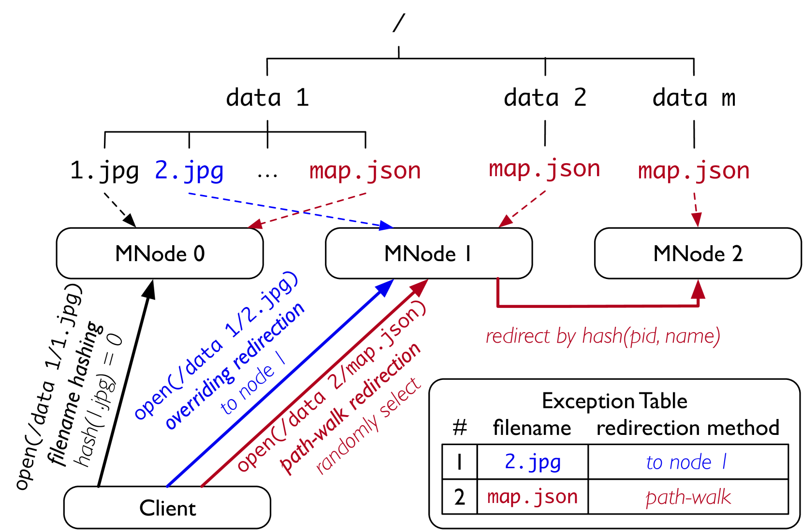
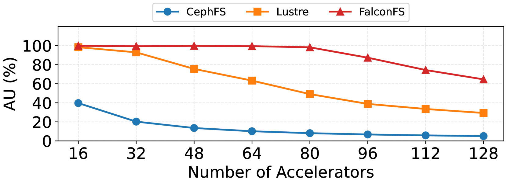

---
# You can also start simply with 'default'
theme: apple-basic
# random image from a curated Unsplash collection by Anthony
# like them? see https://unsplash.com/collections/94734566/slidev
# background: ./falcon.jpg
# some information about your slides (markdown enabled)
title: FalconFS
info: |
  Learn more at [fuis.me](https://fuis.me)
# apply unocss classes to the current slide
# class: text-center
# https://sli.dev/features/drawing
drawings:
  persist: false
# slide transition: https://sli.dev/guide/animations.html#slide-transitions
transition: slide-left
# enable MDC Syntax: https://sli.dev/features/mdc
mdc: true
# open graph
seoMeta:
  # By default, Slidev will use ./og-image.png if it exists,
  # or generate one from the first slide if not found.
  ogImage: auto
  # ogImage: https://cover.sli.dev
layout: intro-image
image: ./public/falcon.jpg
hideInToc: true
colorSchema: dark
fonts:
  sans: 方正屏显雅宋_GBK
  serif: 方正屏显雅宋_GBK
  mono: Cascadia Code
---

<!-- markdownlint-disable MD033 MD040 MD024 MD025 MD045 MD022 MD003 -->

  <h1>FalconFS</h1>
  
Distributed File System for Large-Scale Deep Learning Pipeline

---
layout: intro-image-right
image: "./public/falcon.jpg"
hideInToc: true
---

# 目录

<Toc />

---

# 背景

- 深度学习场景，需要管理巨量小文件
  - Transformer：需要巨量的文本数据进行预训练，data-hungry
  - 高质量文本数据已经基本用尽
- 训练场景：需要从数据集里随机选取 batch

## 推荐阅读

Big Metadata: When Metadata is Big Data

Pavan Edara and Mosha Pasumansky. Big Metadata: When Metadata is Big Data. PVLDB, 14(12): 3083 - 3095, 2021.

---
hideInToc: true
---

# 数据仓库和数据湖

- 数据仓库：数据在写入前就预先定义好结构
  - 处理来源多样、格式各异的大数据时显得力不从心，灵活性差
- 数据湖：先将所有原始格式的数据完整地存储起来
  - 尤其适合业务模式尚不清晰的探索阶段

<!--
  - 后续再根据分析需求进行处理和应用 -->

## 现代数据湖方案：Apache IceBerg、Delta Lake、DuckLake 等

- 在底层存储（HDFS、S3）上，构建了智能的元数据管理层
- 通过管理数据和元数据，为文件系统带来了数据库级的特性
  - ACID 支持
  - 高效的数据更新（Upsert/Delete）与读取
  - 版本回溯

---
hideInToc: true
---

# 深度学习流程

华为自动驾驶系统中采用的深度学习训练管道架构

该管道由四个关键阶段组成：摄取、标注、训练、归档

<!--
该管道由四个关键阶段组成：摄取阶段从真实世界环境收集原始数据。标注阶段通过一系列模型推理任务为原始数据生成标签，包括移动物体检测、车道检测、交通标志检测等。然后，训练阶段使用标记数据集来训练用于车辆部署的目标模型。在最终的归档阶段，数据集被转移到低成本存储系统（如云数据湖）以供将来参考[49, 30, 51, 16]。类似的架构也存在于其他深度学习工作负载中[51, 1, 31]。
-->

---
hideInToc: true
---

# FalconFS

FalconFS 已在华为自动驾驶系统的生产环境中使用 10,000 个 NPU 运行了一年

## 核心思想

- 实现多数文件操作的单跳访问，移除客户端元数据缓存

## 评估

FalconFS vs CephFS, Lustre

- FalconFS 在小文件读写方面实现了高达 5.72× 的吞吐量（对比CephFS）
- 在深度学习模型训练方面实现了高达 12.81× 的吞吐量（80-128 GPU规模下对比CephFS的11.09-11.81×提升）

---

# DL workload pattern

1. Enormous small objects in large directories
   - 自动驾驶流程消耗多模态数据，包括图像、点云
   - 标注和训练过程中，这些对象被存储为单个文件，其大小从几 KiB 到几 MiB 不等
     - 大多数在 256KiB 以内
   - 生产环境中，实时数据集扩展到数百 PB，并由超过 30 亿个小文件组成
   - 这些文件按时间戳、车辆 ID、相机 ID 等进行分组，形成包含数十亿个目录和大型目录大小的目录树

2. Random file traversal
   - 训练阶段：随机访问数据集，每个文件只访问一次（客户端缓存💥）

<!--
LRU 失效：当缓存较小时，LRU 策略优先保留靠近根目录的目录，而最后一级目录的命中率——在实验中构成 90%的访问——与缓存大小成正比
-->

---
hideInToc: true
---

# DL workload pattern

3. Burst file access
   - 在标注阶段，推理任务读写文件，涉及大量小文件 IO 和目录列表
   - 为充分利用 GPU 的并行性，数据对象以批量方式访问和处理，导致同一目录下的突发文件访问
   - 这可能导致元数据服务器上的瞬时负载不平衡，从而降低性能

4. Tight Resource budget
   - CPU 和内存是计算节点的稀缺资源
   - 要让渡资源给训练任务

<!--
burst size=100 时，元数据服务器（MDS）在读取操作期间经历了严重的负载不平衡
这个问题产生的原因是 CephFS 倾向于将同一目录中的文件元数据存储在一起；因此，对同一目录中的文件进行突发操作可能会使单个 MDS 拥塞，从而导致性能瓶颈
-->

---

# POSIX I/O

文件系统：实现文件的 **按名存取**

- open/close
- lseek
- fsync
- truncate
- chmod/chown
- read/write
- aio_read/aio_write/aio_suspend

---
hideInToc: true
---

# POSIX I/O 优缺点

优点：便于与现有应用程序和框架集成

## 缺点

- POSIX 接口和分层目录组织并不适合分布式环境
  - 客户端打开相同的文件，需要大量相同的 path resolve，带来大量的 lookup 和 getattr 操作
- POSIX 是有状态协议
  - 需要 open() 得到 fd，根据 fd 维护状态信息
  - 在百万和上亿级别个进程进行 I/O 操作时，元数据操作成为性能的瓶颈
- POSIX 元数据定义太死：通常数据集中会自己定义 `meta.csv`
- POSIX 元数据需求强一致 => Meta 需分布式事务
- 数据面：`write()` 成功后，其他 `read()` 必须看到最新数据
  - 很多分布式文件系统放松了此语义，转向 close-to-open：JuiceFS、NFS

<!--
- 许多关键用例中存在效率问题
-->

<!--
https://zhuanlan.zhihu.com/p/571830121
https://zhuanlan.zhihu.com/p/571563819
-->

---
hideInToc: true
---

# POSIX 目录层次结构下的路径解析

- 树状组织要求 DFS 频繁进行路径解析
- 在进行任何文件操作（如 read/write）之前，DFS 客户端必须解析完整路径以定位目标文件的 inode
- 路径解析需要在 client 和 meta 之间进行多次往返通信：单个文件操作涉及多个网络请求

<!--
2. 这涉及验证路径上每个目录的存在性和权限
-->

---

# 降低 path resolve 开销

- 现有的 DFS 采用客户端元数据缓存：有状态客户端
  - 客户端维护本地目录/文件元数据缓存以避免频繁远程查找

这种有状态客户端的结构，不适合深度学习训练负载：

- 每次迭代从包含大量文件的目录中随机选取一个 batch
  - 千亿文件 vs batch=50
  - 单卡 A100 80G 可以在 INT8 精度下 batch=50
- 访问都是随机的：为了 working set 设计的缓存不适用

面临的挑战：

- 要么消耗大量客户端内存来缓存大型目录树
- 要么由于请求放大而导致性能严重下降

<!--
https://hub.baai.ac.cn/view/29387
-->

<!--
华为的一个生产集群可以扩展超过 1000 个客户端节点，一个典型的生产数据集包含数十亿个目录。鉴于在 Linux VFS 中，缓存一个目录需要 800 字节（其中 inode 占用 608 字节，dentry 占用 192 字节），在每个节点上缓存 10%的 10 亿个目录将需要每个节点 80 GiB，总共 80 TiB
-->

---
hideInToc: true
---

# 有状态客户端缓存大小与吞吐的关系

客户端缓存大小显著影响读取吞吐量，以及 remote request 数量

- 跟踪 Resnet-50 模型训练：1000 万个 64KiB 文件，存储在 1 百万个 7 级目录中
- 一个具有 4 个 MDS 和 12 个 OSD 的 CephFS 实例
- io thread=512

---

# 如何解决有状态客户端的问题

FalconFS 提出了无状态客户端架构：

- 无需客户端缓存，大多数文件操作实现了单跳访问，路径解析移至服务器端

还需要：

1. 客户端需要知道文件 inode 在哪台服务器上。Q1
   - FalconFS 提出了混合元数据索引方法
2. 每个服务端都可以本地进行 path resolve，而不是进行网络跳转。Q2
   - Lazy namespace replication，将文件系统的目录树复制到所有元数据服务器
   - 目录树的修改采用 lazy replicate 模式：基于失效进行并发控制

<!--
(1) 由于计算节点的资源预算紧张，如§2.2 所述，服务器比客户端拥有更多的内存资源。
(2) 典型的深度学习集群通常拥有远比元数据服务器多的客户端。在华为的部署环境中，客户端机器与服务器机器的比例超过 40:1，且每台客户端机器可以托管多个客户端。考虑到所有客户端在深度学习管道中共享相同的数据集，服务器端的 dentry 可以服务于比客户端缓存更多的客户端。
(3) 带状态客户端的分布式文件系统通常使用 VFS dcache 和 inode 缓存来缓存目录属性[48, 4, 3, 15]，每个目录需要 800 字节。在服务器端，目录条目可以以自定义格式维护，其大小小于 100 字节。
-->

---

# 初次路由：客户端如何知道文件 inode 在哪

一般的做法：

- 路径部分哈希（分桶）：例如，使用父目录 ID 作为键进行哈希
- 全路径哈希：整个路径作为哈希，目录重命名变得极其昂贵

## FalconFS

混合索引：a hybrid indexing of hashing and path-walking

核心优势：

- 结合哈希的快速定位和路径遍历的准确性
- 动态负载均衡：通过 exception table 处理热点文件名
- 支持目录重命名操作，避免全路径哈希的性能问题

---

# FalconFS 架构

---
hideInToc: true
---

# FalconFS 架构详解

- 元数据节点（MNode）是带有定制扩展的 PostgreSQL 数据库
  - 每个 MNode 维护一个懒惰同步的目录树结构（命名空间副本）和文件属性（inode）的一部分
  - 主从复制
    - 目录复制到全体 MNode 上。对于十亿个目录，每个 MNode 的命名空间副本存储占用小于 100 GiB
    - 文件，inode，通过 hybrid indexing 方式，分布到所有 MNode 上
- central coordinator 管理命名空间更改，运行一个负载平衡算法，以平衡 MNodes 之间的 inode 分布
- **并发请求合并**：客户端将多个文件操作请求合并为单个批量请求，减少网络往返次数，显著提升深度学习训练场景下的数据加载效率

---

# Hybrid Metadata Indexing

为了加速路径解析，常规情况下采用文件名哈希

---
hideInToc: true
---

# Hybrid Metadata Indexing 深入分析

问题：只用文件名进行 hash 无法保证文件在不同服务器之间均匀分布

解决方案：

- 深度学习数据集通常具有较大的目录大小，其大小可能比 MNode 的数量多几倍
- 根据大数定律，当目录数量远大于MNode数量时，文件在各个目录中分配到 MNode 的分布趋于均匀

<!--
大数定律：当样本数据无限大时，样本均值趋于总体均值
某个随机事件在单次试验中可能发生也可能不发生，但在大量重复实验中往往呈现出明显的规律性，即该随机事件发生的频率会向某个常数值收敛，该常数值即为该事件发生的概率
https://zh.wikipedia.org/wiki/%E5%A4%A7%E6%95%B8%E6%B3%95%E5%89%87
-->

解决方案：

- 某些情况下，文件名哈希可能导致文件分布不均
  - 应用程序的命名规范可能导致某些文件名比其他文件名更频繁
    - 比如基本所有的 C++ 项目里都有很多个 `CMakeLists.txt`
  - 唯一文件名的数量与 MNodes 的数量相差不大
    - 这可能因 Hash fn 自身的 Hash Variance 而导致分布不均衡

增加选择性重定向机制：维护例外重定向表（文中叫 exception table）

该表指定了哪些文件名以及如何进行重定向

<!--
1. 为了放置具有热文件名的文件，FalconFS 不仅根据文件名，还根据其父目录 ID 计算哈希值。因此，即使一个热文件名存在于多个目录中，相应的文件也会放置在不同的 MNode 上

2. 客户端在异常表中遇到标记为重定向的文件时，会直接向其指定的 MNode 发送请求
-->

---

# 负载均衡

Coordinator 使用 MNode 周期性报告的统计数据来做出重新平衡的决策

每个 MNode 周期性地报告：

- 本地 inode 数量
- 出现频率最高的 $O(n \log n)$ 本地文件名及其出现次数，其中 $n$ 是 MNode 的数量

目标：

- 目标是使每个节点的 inode 数量占总 inode 总数的比例，不超过 $\frac{1}{n} + \epsilon$
- 最小化例外重定向表的大小

检测到不平衡时，开始运行：

- 首先确定当前系统中负载最高（$N_\text{max}$）和负载最低（$N_\text{min}$）的两个节点
- 选择目标：精准地选择在 $N_\text{max}$ 上出现频率最高的文件名
- 选取策略：最小化最大 inode 计数
  - 并均匀地分散到系统中的所有节点上；或整体地从 $N_\text{max}$ => $N_\text{min}$

---

# Lazy Namespace Replication

FalconFS 在每个 MNode 上维护一个一致的但不一定完整的命名空间副本

<!-- - 以实现本地路径解析 -->

设计灵感：

- 推迟同步到访问时。在所有 MNodes 上急切地复制目录创建将需要昂贵且不可扩展的两阶段提交
- 使用失效机制作为轻量级锁
  - 当操作修改目录结构或权限时，为了保持一致性，必须阻止修改目录下子树中的并发操作
  - 通过在所有节点上使能相应的副本条目失效来替代传统的两阶段锁，从而节省了一轮请求广播
- 性能优势：避免分布式事务开销，提高元数据操作吞吐量

---

# VFS 兼容性

需要绕过内核中的 VFS 路径解析逻辑

- 当 VFS 调用客户端模块为路径中的中间目录提供的 `lookup()` 方法时：返回权限为 `0777` 的目录属性以通过 VFS 检查
  - VFS 在路径遍历时设置全局状态标志 `LOOKUP_PARENT`，以指示最终组件尚未到达
- 当 VFS 触发对最后一个路径组件的操作时，客户端模块将完整路径发送到元数据服务器，执行实际路径解析以及对应的操作
  - 为防止因缓存复用导致虚假属性暴露给用户，客户端模块利用了 VFS 的 `d_revalidate()` 方法
    - 预留了一对 uid 和 gid 来标识虚假属性
    - 当发生 dcache 命中时，VFS 会调用 `d_revalidate()` 方法来验证缓存条目
    - 客户端模块随后通过 uid 和 gid 检查命中条目是否为虚假条目，以及该条目是否正在用于解析最终路径组件（通过 `LOOKUP_PARENT` 标志）
      - 如果两个条件都满足，该模块将从 MNode 获取真实属性并更新 dcache 条目。

---

# 评估

P.S. 论文评估部分详细展示了 FalconFS 的优势，建议参考原文

<!-- - MLPerf Storage Benchmark
  - 分布在 100 万个目录中的 1000 万文件上训练 ResNet-50，每个文件大小为 112 KiB
- JuiceFS 被省略，因为其在数据集初始化期间吞吐量降至零
  - JuiceFS：这个版本负载均衡没做好，直接一个💥
- 以 90% AU 为阈值，FalconFS 支持高达 80 个 GPU
- 而 Lustre 仅支持 32 个 GPU，CephFS 未达到阈值
- 在 80 到 128 个 GPU 之间
  - FalconFS 相对于 CephFS 实现了 11.09–11.81x 的训练吞吐量加速
  - 相对于 Lustre 实现了 0.99–1.23× 的训练吞吐量加速 -->

<!--
AU：Accelerator Utilization（AU，加速器利用率）在MLPerf Storage Benchmark 中，通常被定义为GPU 计算时间占整个基准测试运行时间的百分比。
-->

---
layout: quote
hideInToc: true
---

# Thanks for listening

QA time!

<!--
# 总结

- 元数据也是数据
- 客户端缓存在训推场景下不适用
- 训推场景下，要加速路径解析，提高 retrieve batch 的性能，加速训推
-->
